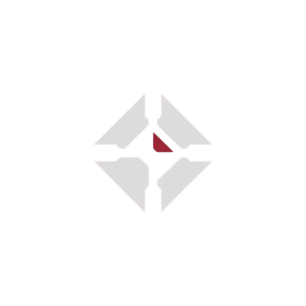

<div align="center">

<!-- Replace with your actual logo path -->


# Dead Man's Switch

> *"In the void between stars, death comes without warning."*

A decentralized dead man's switch built for EVE Frontier pilots. Set a silence threshold — if you disappear, your SUI deposit and final message are delivered to your chosen beneficiary. Automatically. Permanently. On-chain.

[](https://www.evefrontier.com)
[](https://suiexplorer.com)
[](https://move-language.github.io)
[](https://nextjs.org)
[](LICENSE)

**Live Demo:** https://dead-mans-switch-gilt.vercel.app  
**Smart Contract:** `0x2ed69dfc575e0fd3ad6f92705cc8ee5f061534c5d16a630d02892cef804bc7ec` · Sui Testnet

</div>

---

## Overview

EVE Frontier is a game where death is real and assets have weight. **Dead Man's Switch** extends that philosophy beyond the game — a pilot who goes dark for too long triggers an irreversible on-chain transfer to whoever they trusted most.

No intermediaries. No appeals. The contract executes when silence exceeds the threshold.

---

## How It Works

**1. Arm the Switch**  
Connect your Sui wallet, define a beneficiary address, choose a silence threshold (3 / 7 / 14 / 30 days), lock a SUI deposit, and sign an optional last message. The switch is written to the Sui blockchain.

**2. Stay Active**  
Check in periodically to reset the timer. As long as you're alive and present, nothing happens.

**3. Trigger on Silence**  
If you exceed the threshold without checking in, anyone can call `trigger_switch`. The contract verifies the deadline on-chain and transfers the locked SUI directly to your beneficiary — along with your final message.

---

## Features

- **Dual auth** — Login via email/Google (Privy) or directly with a Sui wallet (Slush)
- **Full on-chain execution** — ARM, check-in, disarm, and trigger are all smart contract calls
- **Mission Control dashboard** — Live countdown timers, danger indicators, one-click check-in
- **Claim portal** — Beneficiaries can look up a switch by Object ID and trigger it if eligible
- **Atmospheric UI** — Dark, minimal, lore-accurate design built for the Frontier

---

## Smart Contract

Written in Move, deployed on Sui Testnet. Four callable functions:

| Function | Who Can Call | What It Does |
|---|---|---|
| `create_switch` | Owner | Arms the switch, locks SUI deposit in escrow |
| `check_in` | Owner only | Resets the deadline, proves activity |
| `withdraw` | Owner only | Disarms the switch, returns deposit |
| `trigger_switch` | Anyone | Transfers deposit to beneficiary if deadline passed |

The contract enforces all invariants — early triggers are rejected, double-triggers are blocked, only the owner can check in or disarm.

---

## Tech Stack

| | |
|---|---|
| Framework | Next.js 16 (App Router) |
| Auth | Privy (email, Google, embedded wallet) |
| Wallet | Slush / @mysten/dapp-kit |
| Smart Contract | Move on Sui Testnet |
| Blockchain Reads | Sui JSON-RPC (direct fetch) |
| Styling | Tailwind CSS |
| Deployment | Vercel |

---

## Run Locally

```bash
git clone https://github.com/theodhorex/dead-man-switch
cd dead-man-switch
npm install --legacy-peer-deps
npm run dev
```

Open `http://localhost:3000`

To test contract interactions, get testnet SUI from [faucet.sui.io](https://faucet.sui.io) and connect a Slush wallet.

---

## Hackathon

Built for the **2026 EVE Frontier x Sui Hackathon** — targeting the **Weirdest Idea** and **Utility** tracks.

The concept is native to EVE's lore: a universe where death is permanent, assets have real value, and trust is scarce. Dead Man's Switch turns that tension into a functional on-chain primitive — dark by design, useful by necessity.

---

## What's Next

- Multi-beneficiary support with percentage splits
- EVE Frontier API integration — use in-game activity as check-in signal
- NFT-based "Last Will" certificates for beneficiaries
- Trigger notifications via on-chain event subscriptions
